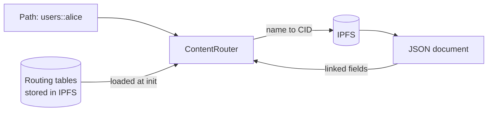

# ipfs-system

A TypeScript library that resolves named paths like `users::alice` to IPFS content and follows the links between stored JSON documents.



IPFS addresses content by its hash. That makes data verifiable and easy to replicate, but it also means an address changes every time the content does. If one document points to another by CID, editing the child forces a new CID for the parent, and for every document above it. Applications end up either hardcoding hashes that go stale or keeping a separate database that maps names to the current CID, which puts a central server back in the middle of a system meant to avoid one.

IPNS gives you mutable names, but each name is tied to a key and resolution is slow, so it does not work well for many small, interlinked records. Neither IPFS nor IPNS lets you fetch a document and the documents it references in a single call.

This library adds a naming layer on top of IPFS. Documents refer to each other by name instead of by hash, the tables that map names to CIDs are themselves stored in IPFS, and one call can walk the links.

## Example

```ts
import { ContentRouter } from "ipfs-system";

// ipfs: an IPFS client from @mysticaldragon/ipfs
const router = new ContentRouter(ipfs, {
  users: [
    { alice: { name: "Alice", friends: ["users::bob"] }, bob: { name: "Bob" } }
  ]
});

await router.init();

await router.resolve("users::alice", { friends: true });
// { name: "Alice", friends: [{ name: "Bob" }] }
```

## How it works

Each router has a namespace and a list of sources. A source is either the CID of a stored table that maps names to paths, or an inline object. For an inline object, each entry is published to IPFS and the resulting table is published as well. At initialization the tables are fetched and merged in order, and later sources override earlier ones. The merged result is held in memory.

A path with no `::` is treated as a raw CID. A path of the form `namespace::name` is looked up in that namespace's table, and the value may itself be another named path, which is resolved recursively until it reaches a CID. Resolving takes a projection object that says which fields to follow. A field holding a path, or an array of paths, is replaced with the resolved documents, and nested projections go deeper.

## Limitations

Signature verification is not implemented. The `Signature` and `SignedData` types exist, but nothing checks them, so any content reachable through a table is trusted. There is no way to update a routing table in place: changing a name means publishing a new table and calling `init()` again. Routing cycles are not detected and will recurse without end. There are no tests.

Do not use it where content authenticity matters, or where names need to change often and be seen right away by other readers.
